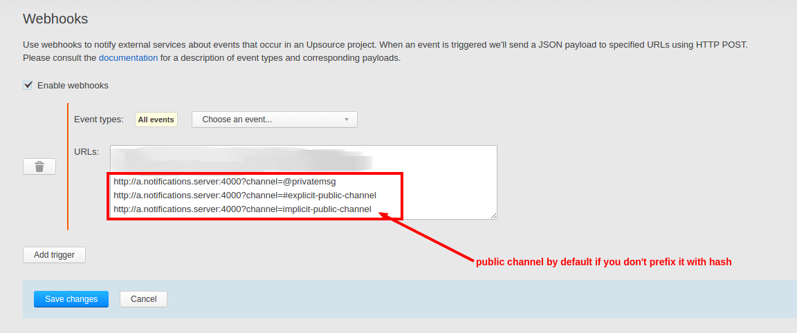

# upsource-slack-api-adapter
Transforms Upsource webhooks to Slack compatible requests

## Upsource events currently supported
* ReviewCreatedFeedEventBean
* ReviewStateChangedFeedEventBean
* ParticipantStateChangedFeedEventBean
* NewParticipantInReviewFeedEventBean
* RemovedParticipantFromReviewFeedEventBean
* DiscussionFeedEventBean

## Requirements
Tested to run on NodeJS 6. Other versions may be supported.

## Configuration
The Slack webhook end point needs to be provided in config.json in the following format:
```
{
  "slackWebhookUrl": "link-to-slack-webhook"
}
```
Save this file in the root directory of the project.
See `sample.config.json` for an example.

The application runs on port 4000. Redirect Upsource webhook to this address.

## Upsource webhook configuration



you can ommit `?channel=(.*)` parameter, in which case the notification 
will be posted to the hook's default channel 

## Running the adapter
Copy `sample.config.json` to `config.json` and adjust webhook url, upsource user and
password, then as usual:

* Install npm dependencies by running `npm install`
* Start the application by executing `npm start`


